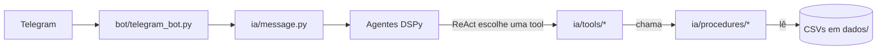
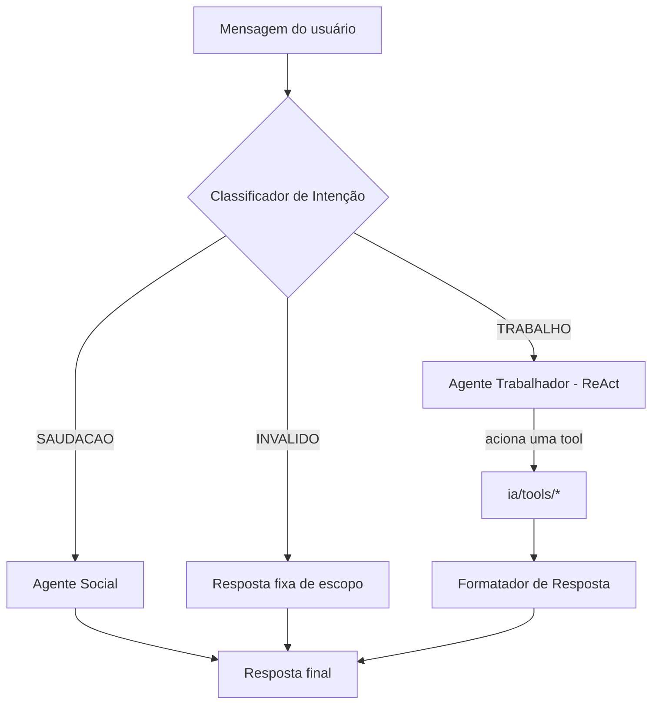
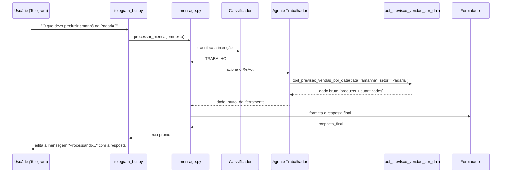

# API 1º Semestre ADS

# 🧠 Arquitetura — MIA

<!-- >> Este documento complementa o [README.md](../../../README.md) principal. Enquanto o README fala sobre o **produto** (desafio, backlog, equipe), este arquivo documenta a **arquitetura de código** do backend: como as camadas se comunicam e como o fluxo de mensagens acontece na prática. -->

<<<<<<< Updated upstream
## Sumário
- [Visão geral das camadas](#visao-geral)
- [1. Utilitários Globais (`utils.py`)](#utils)
- [2. Motor de Dados: Procedures (`procedures/`)](#procedures)
- [3. Ferramentas da IA: Tools (`tools/`)](#tools)
- [4. Agentes de IA e Fluxo de Mensagens](#agentes)
<!-- - [Nota de manutenção](#manutencao) -->

---

## Visão geral das camadas <a id="visao-geral"></a>

O backend separa estritamente duas responsabilidades:

- **Procedures** → motor matemático e de dados, com Pandas. Não sabe nada sobre IA.
- **Tools** → interfaces semânticas formatadas para o DSPy, que chamam as Procedures por baixo.


=======
 <p align="center">
  | <a href ="#desafio"> Desafio</a>  |
  <a href ="#solucao"> Solução</a>  |   
  <a href ="#backlog"> Backlog do Produto</a>  |
  <a href ="#dor">DoR</a>  |
  <a href ="#dod">DoD</a>  |
  <a href ="#sprint"> Cronograma de Sprints</a>  | 
  <a href ="#tecnologias">Tecnologias</a> |
  <a href ="#manual">Manual de Instalação</a>  | 
  <a href ="#equipe"> Equipe</a> |
</p>

<br>

> Status do Projeto: Concluído ✅
>
> Relatório de Testes: [PDF](docs/processo/sprints/sprint-1/testes/Relatorio%20de%20Testes%20-%20Sprint%201.md)
>
> Pasta de Documentação: [Link](docs/cliente)
<!--
> 
> Video do Projeto:  [Youtube](https://youtu.be/)
-->

## 🎯 Desafio <a id="desafio"></a>

Apesar do avanço tecnológico, a gestão diária de setores operacionais em **supermercados** (como padaria, açougue e reposição de gôndolas) ainda se baseia fortemente em planilhas estáticas. Essa realidade cria um distanciamento da era da Inteligência Artificial, pois os dados não estão organizados em pipelines modernos.

Nos corredores, estoques e áreas de preparo, gerentes e líderes enfrentam problemas diretos:

* **Falta de Agilidade:** Precisar sair do salão de vendas, ir até o escritório e aplicar filtros no Excel para saber o que precisa ser produzido ou reposto no dia.
* **Mãos Ocupadas:** O ambiente de varejo exige mobilidade constante (conferência de validade, manuseio de caixas e atendimento), tornando o uso de teclado e mouse pouco prático durante a supervisão.
* **Sistemas Engessados:** Softwares tradicionais ou bots antigos exigem que o usuário decore comandos rígidos (ex: `/producao_padaria`), o que diminui a adoção da ferramenta pela equipe.

<br>

## 💡 Solução <a id="solucao"></a>

Desenvolvemos um **Assistente de Análise de Dados** integrado ao Telegram, projetado para extrair insights diretamente das planilhas do mercado (arquivos CSV) utilizando Python, sem a necessidade de migração para bancos de dados complexos.

O diferencial da solução é a fricção zero com o usuário. A plataforma atua de forma semelhante a uma "Alexa corporativa" para o varejo:

* **Integração com Pandas:** O motor de análise em Python lê, cruza e filtra os dados de estoque, produção e validade dos CSVs instantaneamente.
* **Linguagem Natural:** O gestor não precisa usar comandos. Ele interage de forma conversacional (ex: *"O que precisamos assar na padaria hoje?"* ou *"Quero saber quantos produtos precisam ser produzidos hoje?"*), e a IA interpreta a intenção e os parâmetros da busca.
* **Insights Diretos:** O bot devolve a resposta processada, mastigada e formatada no chat, economizando tempo e apoiando a tomada de decisão rápida sobre reposição, redução de desperdícios (perdas de hortifruti/açougue) e lucros.
<!-- * **Acessibilidade por Voz:** Suporte nativo para recebimento de perguntas via mensagens de áudio no Telegram, permitindo consultas *hands-free* diretamente do estoque ou do salão de vendas. 3º-->

---

## 📋 Backlog do Produto <a id="backlog"></a>
| Rank | Prioridade | User Story | Story Points | Sprint | Status |
| :--: | :--------: | :--- | :----------: | :----: | :----: |
|   **1**  |    **Alta**    | Eu, como líder, quero saber quais produtos precisam ser produzidos, a fim de reduzir o desperdício de tempo e produto. |      13       |    1   |    ✅   |
|   **2**  |    **Alta**    | Eu, como líder, quero saber quantos produtos precisam ser produzidos, a fim de reduzir o desperdício de tempo e produto. |      8       |    1   |    ✅   |
|   **3**  |    **Média**   | Eu, como gerente, quero saber o que foi produzido no dia X pelo setor Y, a fim de verificar a produtividade do setor Y. |      13       |    1   |    ✅   |
|   **4**  |    **Média**   | Eu, como gerente, quero saber o que deveria ter sido produzido no dia X pelo setor Y, a fim de consultar a meta ideal de produção estipulada para a data. |      21       |    1   |    ✅   |
|   **5**  |    **Média**   | Eu, como líder, quero saber quais produtos me trazem mais lucro, a fim de otimizar o tempo dos colaboradores. |      -*-*-       |    2   |    ❌   |
|   **6**  |    **Média**   | Eu, como líder, quero saber quantos reais foram descartados, a fim de monitorar o impacto financeiro das perdas do meu setor. |      -*-*-       |    2   |    ❌   |
|   **7**  |    **Média**   | Eu, como gerente, quero saber quantos reais foram descartados, a fim de avaliar o custo global de desperdício da empresa. |      -*-*-       |    2  |    ❌   |
|   **8**  |    **Baixa**   | Eu, como gerente, quero saber quais produtos me trazem mais lucro, a fim de orientar estrategicamente os setores. |      -*-*-       |    2   |    ❌   |
|  **9**  |    **Baixa**   | Eu, como gestor, quero interagir com o assistente de análise de dados enviando perguntas por áudio, a fim de obter insights das planilhas de forma fluida e sem contato manual (semelhante a uma Alexa). |      -*-*-       |    3   |    ❌   |
|   **10**  |    **Baixa**   | Eu, como líder, quero saber quanta matéria-prima eu preciso deixar preparada para o dia seguinte, a fim de otimizar o tempo e reduzir o desperdício de matéria-prima. |      -*-*-       |    3   |    ❌   |
|  **11**  |    **Baixa**   | Eu, como líder, quero saber quais matérias-primas estão disponíveis para transferir a outros setores, a fim de reaproveitar recursos parados e evitar compras desnecessárias. |      -*-*-       |    3   |    ❌   |
|  **12**  |    **Baixa**   | Eu, como gerente, quero saber por que o produto X está sendo transferido de setor, a fim de identificar falhas no planejamento original da produção. |      -*-*-       |    3   |    ❌   |
>>>>>>> Stashed changes

---

## 1. Utilitários Globais (`ia/tools/utils.py`) <a id="utils"></a>

Funções de apoio usadas pelas *tools* antes de acionar as *procedures*.

| Função | Assinatura | O que faz |
| --- | --- | --- |
| `dspy_tool` | `dspy_tool(func)` | Decorador que registra a função na lista `TOOLS_DISPONIVEIS`, usada pelo agente `ReAct` para saber quais ferramentas existem. |
| `converter_data_relativa` | `converter_data_relativa(data_alvo: str) -> str` | Intercepta gírias de data (`"hoje"`, `"hj"`, `"amanhã"`, `"amanha"`, `"ontem"`) e converte para `DD/MM/AAAA`. Se já vier uma data válida, devolve o texto intacto. |
| `normalizar_setor` | `normalizar_setor(setor_informado: str) -> str \| None` | Corretor ortográfico e mapeador de apelidos de setor (ex: `"cozinha"` → `"Cozinha/Rotisseria"`, `"acougue"` → `"Açougue"`). Devolve `None` para entradas vazias/`"null"`/`"none"`. |
| `dias_ate_pagamento` | `dias_ate_pagamento(valor: str) -> int` | Calcula a distância em dias até o ciclo de pagamento mais próximo (dia 20 ou 5º dia útil do mês), antecipando o pagamento se cair em fim de semana. Retorna `0` se a data informada já for dia de pagamento. |
| `classificar_dia` | `classificar_dia(data: str) -> int` | Devolve `1` (dia bom) ou `0` (dia ruim), com base em: é dia de pagamento? é sexta/sábado/domingo? é feriado (via `holidays`, calendário `BR`/`SP`)? |

---
<<<<<<< Updated upstream

## 2. Motor de Dados: Procedures (`ia/procedures/`) <a id="procedures"></a>

Todo acesso é feito através do módulo agregador `procedures.py`, que expõe cada arquivo como um "apelido":

```python
import ia.procedures.procedures as procedures

procedures.vendas.buscar_por_nome_produto("coxinha")
procedures.produtos.buscar_por_setor("Padaria")
procedures.descarte.buscar_por_data("20/09/2026")
```

### `vendas_procedures.py` (módulo `vendas`)

| Função | Assinatura | O que faz |
| --- | --- | --- |
| `todas_as_vendas` | `() -> pd.DataFrame` | Devolve o *dataframe* bruto com o histórico de vendas (agosto + setembro/2026 concatenados). |
| `dias_ate_pagamento` | `(valor: str) -> int` | Calcula a distância em dias até o ciclo de pagamento mais próximo (dia 20 ou 5º dia útil do mês), antecipando o pagamento se cair em fim de semana. Retorna `0` se a própria data for dia de pagamento. |
| `dataframe_vendas_similares` | `(data: str, filtro_dia: int) -> pd.DataFrame` | Filtra o histórico completo, devolvendo apenas os dias com o mesmo perfil (`filtro_dia`) da data informada. |
| `media_vendas_produtos` | `(vendas: pd.DataFrame, setor: str = None) -> list[str]` | Agrupa por produto, calcula a média de vendas e arredonda **para cima** (`math.ceil`). Devolve algo como `['Pão Francês: 150']`. Se `setor` for informado, filtra antes pelos produtos daquele setor. |

### `producao_procedures.py` (módulo `producao`)

| Função | Assinatura | O que faz |
| --- | --- | --- |
| `calcular_producao_setor_data` | `(data: str, setor: str) -> dict \| None` | Cruza **Vendas** e **Descarte** de uma data/setor específicos e soma `Produção = Vendas + Descarte` por produto. Devolve `None` se o setor não existir, ou um dicionário `{produto: {"vendas": int, "descarte": int, "producao": int}}` filtrando itens zerados. |

> Também existem `produtos_procedures.py`, `descarte_procedures.py`, `ingredientes_procedures.py` e `regras_procedures.py` no mesmo padrão (busca por nome, por setor, por data), usados como dependência pelos módulos acima.

---

## 3. Ferramentas da IA: Tools (`ia/tools/`) <a id="tools"></a>

Ponte entre as *Procedures* e o DSPy. As docstrings destas funções **são** a documentação que o modelo de linguagem lê para decidir qual ferramenta acionar — por isso a fonte da verdade sobre o comportamento de cada tool é o próprio código, não uma cópia aqui.

### Produção & Previsão (`producao_tool.py`)

| Tool | Assinatura | Foco |
| --- | --- | --- |
| `tool_previsao_vendas_por_data` | `(data: str = "hoje", setor: str = None, tipo_pergunta: str = "quanto") -> str` | **Ação e futuro.** O que *deve* ser produzido. |
| `tool_meta_producao_passada` | `(data: str = "hoje", setor: str = None, tipo_pergunta: str = "quanto") -> str` | **Auditoria e passado.** O que *deveria* ter sido produzido (relatório de meta para gerentes). |
| `tool_producao_dia_pelo_setor` | `(data: str, setor: str = None) -> str` | **Realizado.** O que *efetivamente* foi produzido, somando vendas + descartes reais (ex: `Coxinha \| Total Produzido: 30 (Vendas: 16, Descarte: 14)`). |

O parâmetro `tipo_pergunta` (`"qual"/"quais"` vs. `"quanto"`) existe nas duas primeiras tools e controla se a resposta lista só os nomes dos produtos ou os nomes com as quantidades.

### Catálogo de Produtos (`produtos_tools.py`)

| Tool | Assinatura | Foco |
| --- | --- | --- |
| `listar_todos_produtos` | `() -> str` | Catálogo completo de produtos. |
| `listar_detalhes_todos_produtos` | `() -> str` | Catálogo completo com Nome, Setor e Tempo de preparo. |
| `informacoes_produto` | `(nome: str) -> str` | Detalhes de um produto específico. |
| `informacoes_produto_setor` | `(setor: str) -> str` | Produtos de um setor específico. |
| `produto_por_tempo_preparo` | `(tempo: str) -> str` | Produtos filtrados por tempo de preparo. |

---

## 4. Agentes de IA e Fluxo de Mensagens <a id="agentes"></a>

### 4.1. Receção e Orquestração

- **`bot/telegram_bot.py > iniciar_bot(bot_key)`** — conecta à API do Telegram, responde `/start` com a apresentação da MIA, ignora formatos não suportados (`audio`, `photo`, `voice`, `video`, etc.) e, para mensagens de texto, exibe "⏳ Processando sua solicitação..." enquanto aciona a IA.
- **`ia/message.py > processar_mensagem(texto_usuario: str) -> str`** — recebe o texto bruto, orquestra a chamada aos agentes DSPy dentro de um `try/except` e trata falhas do modelo (`AdapterParseError`) ou erros gerais de forma amigável para o usuário.

### 4.2. Os 4 Agentes Especialistas (`ia/agentes.py`)



1. **Classificador de Intenção** (`dspy.Predict`) — "porteiro" do sistema. Classifica a mensagem em `SAUDACAO`, `TRABALHO` ou `INVALIDO`, evitando acionar ferramentas complexas sem necessidade.
2. **Agente Social** (`dspy.Predict`) — acionado só na rota `SAUDACAO`. Responde como MIA de forma curta e simpática.
3. **Agente Trabalhador** (`dspy.ReAct`) — o mais complexo. Recebe a lista `TOOLS_DISPONIVEIS`, raciocina sobre qual ferramenta acionar, extrai os parâmetros (data, setor, tipo de pergunta) e devolve o dado bruto (`dado_bruto_da_ferramenta`).
4. **Formatador de Resposta** (`dspy.Predict`) — transforma o dado bruto retornado pela tool em texto natural, seguindo regras fixas de UX Writing: nunca começa com saudação, usa `-` para listas (nunca `*`), e responde só com base no dado bruto recebido.

### 4.3. Fluxo de vida da mensagem — exemplo prático



---

<!-- ## Nota de manutenção <a id="manutencao"></a>

As tabelas de assinaturas acima existem só para dar uma visão geral rápida sem precisar abrir cada arquivo. **A fonte da verdade é sempre o código e a docstring de cada função** — se você adicionar um parâmetro ou mudar o nome de uma função, atualize a tabela correspondente na mesma PR (isso já está previsto no critério "Documentação Atualizada" do [DoD do projeto](../../README.md#dod)). -->
=======

## 📅 Cronograma de Sprints <a id="sprint"></a>

| Sprint          |    Período    | Documentação                                     |
| --------------- | :-----------: | ------------------------------------------------ |
| 🔖 **SPRINT 1** | 07/09 - 27/09 | [Sprint 1 Docs](./docs/processo/sprints/sprint-1/README.md) |
| 🔖 **SPRINT 2** | 05/10 - 25/10 | ⏳ A iniciar |
| 🔖 **SPRINT 3** | 02/11 - 27/11 | ⏳ A iniciar |

## 💻 Tecnologias <a id="tecnologias"></a>

<h4 align="center">
  <!-- Desenvolvimento, Dados e Inteligência Artificial -->
  <a href="https://www.python.org/"></a>
  <a href="https://pandas.pydata.org/"></a>
  <a href="https://github.com/stanfordnlp/dspy"></a>
  <a href="https://ollama.com/"></a>
  <a href="https://ai.google.dev/gemma"></a>
  
  <br>
  
  <a href="https://www.telegram.org/"></a>
  <a href="https://miro.com/"></a>
  <a href="https://www.atlassian.com/software/jira"></a>
  <a href="https://github.com/"></a>
</h4>


## 📖 Manual de Instalação <a id="manual"></a>

### ⚙️ Pré-requisitos

- Git ([Download](https://git-scm.com/downloads))

- Python 3.9+ ([Download](https://www.python.org/downloads/))

- Ollama ([Download](https://ollama.com/download))

- Token de Bot do Telegram (via [BotFather](https://t.me/BotFather))

---

### 1. Clonar o Repositório Principal

```bash
git clone https://github.com/McLorem-Tecnologia/api-1-semestre-2026.git
cd api-1-semestre-2026
```

---

### 2. Configuração do Backend (IA e Bot)

**1° Inicialize os modelos de Inteligência Artificial localmente:**
```bash
ollama pull gemma4:e2b
```
<!-- && ollama pull gemma3:1b -->

**2° Crie e Inicie o Ambiente Virtual Python:**
```bash
cd ./backend
python -m venv venv

# Se você usa Linux/Mac:
source venv/bin/activate 
# Se você usa Windows:
.\venv\Scripts\activate 	 
```

**3° Instale as dependências do projeto:**
```bash
pip install -r requirements.txt
```

**4° Configure as variáveis de ambiente:**
Dentro do diretório `backend/src/`, faça uma cópia do arquivo modelo `.env.example` e renomeie-a para `.env`. Em seguida, abra o arquivo `.env` e insira o seu token do Telegram.

**5° Inicie a aplicação:**
```bash
cd ./src
python main.py
```

**Saída Esperada:**
<br>
Mensagem de sucesso no terminal indicando que as configurações de IA foram carregadas e o Bot do Telegram está online.

---

### 3. Como Usar

Com o Bot online, abra o Telegram, inicie a conversa com a MIA e converse em linguagem natural — sem comandos. Veja o [Manual de Usuário](./docs/cliente/usuário/Manual%20do%20Usuário.md) para exemplos de perguntas e dicas de uso.

---

## 🎓 Equipe <a id="equipe"></a>

<div align="center">
  <table>
    <tr>
      <td align="center">
        <a href="https://github.com/hcastrosilva96">
          <br>
          <sub><b>Henrique de Castro</b></sub>
        </a><br>
        Product Owner<br>
        <a href="https://www.linkedin.com/in/henrique-castro-silva-6568a012b/">LinkedIn</a>
      </td>
      <td align="center">
        <a href="https://github.com/FelipeMoraisOC">
          <br>
          <sub><b>Felipe Morais</b></sub>
        </a><br>
        Scrum Master<br>
        <a href="https://www.linkedin.com/in/felipemoraisoc/">LinkedIn</a>
      </td>
    </tr>
  </table>
  <table>
    <tr>
      <td align="center">
        <a href="https://github.com/mirelacristina">
          <br>
          <sub><b>Mirela Cristina</b></sub>
        </a><br>
        Dev Team<br>
        <!-- <a href="https://www.linkedin.com/in/">LinkedIn</a> -->
      </td>
      <td align="center">
        <a href="https://github.com/eduardogranja">
          <br>
          <sub><b>Eduardo Granja</b></sub>
        </a><br>
        Dev Team<br>
        <!-- <a href="https://www.linkedin.com/in/">LinkedIn</a> -->
      </td>
      <td align="center">
        <a href="https://github.com/IanVRV">
          <br>
          <sub><b>Ian Victor</b></sub>
        </a><br>
        Dev Team<br>
        <a href="https://www.linkedin.com/in/ian-victor-ribeiro-vieira-3147121ba/">LinkedIn</a>
      </td>
      <td align="center">
        <a href="https://github.com/mvlsouza">
          <br>
          <sub><b>Marcus Vinicius</b></sub>
        </a><br>
        Dev Team<br>
        <a href="https://www.linkedin.com/in/mvlsouza">LinkedIn</a>
      </td>
    </tr>
  </table>
  <table>
    <tr>
      <td align="center">
        <a href="https://github.com/leandrotc013-lab">
          <br>
          <sub><b>Leandro Silva</b></sub>
        </a><br>
        Dev Team<br>
        <!-- <a href="https://www.linkedin.com/in/">LinkedIn</a> -->
      </td>
      <td align="center">
        <a href="https://github.com/ag0ulart-dev">
          <br>
          <sub><b>Adham Goulart</b></sub>
        </a><br>
        Dev Team<br>
        <a href="https://www.linkedin.com/in/adham-goulart-4a7320394/">LinkedIn</a>
      </td>
      <td align="center">
        <a href="https://github.com/MATHEUSORTEGA">
          <br>
          <sub><b>Matheus Correia</b></sub>
        </a><br>
        Dev Team<br>
        <!-- <a href="https://www.linkedin.com/in/">LinkedIn</a> -->
      </td>
    </tr>
  </table>
</div>

---

*Desenvolvido com dedicação por estudantes da Fatec para o projeto de API do 1º Semestre de ADS - 2026-2.*
>>>>>>> Stashed changes
