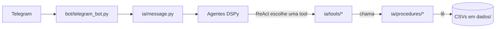
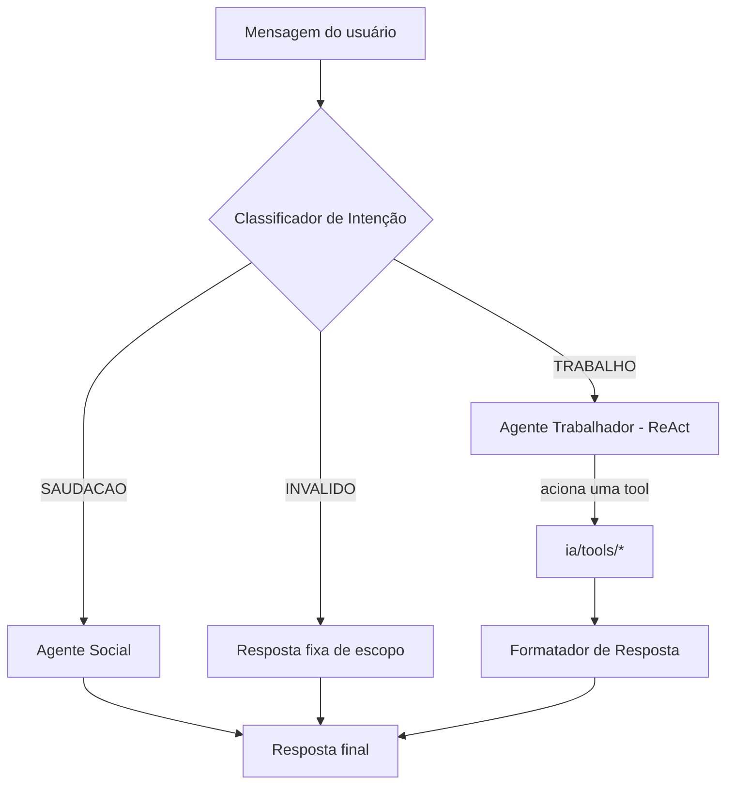
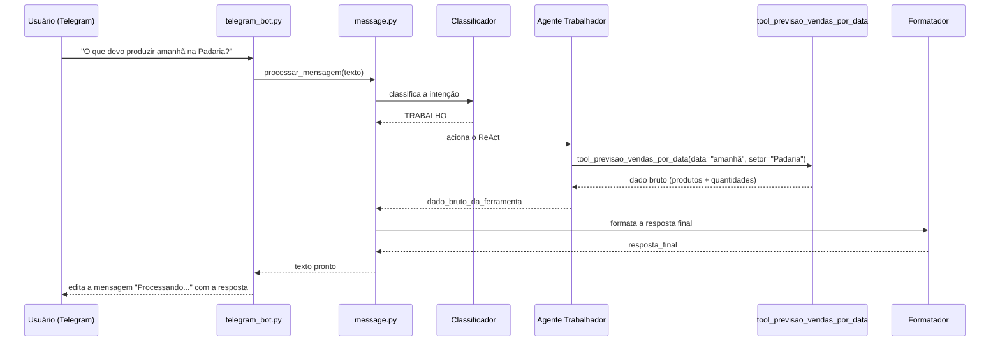

# API 1º Semestre ADS

# 🧠 Arquitetura — MIA

<!-- >> Este documento complementa o [README.md](../../../README.md) principal. Enquanto o README fala sobre o **produto** (desafio, backlog, equipe), este arquivo documenta a **arquitetura de código** do backend: como as camadas se comunicam e como o fluxo de mensagens acontece na prática. -->

## Sumário
- [Visão geral das camadas](#visao-geral)
- [1. Utilitários Globais (`utils.py`)](#utils)
- [2. Motor de Dados: Procedures (`procedures/`)](#procedures)
- [3. Ferramentas da IA: Tools (`tools/`)](#tools)
- [4. Agentes de IA e Fluxo de Mensagens](#agentes)
<!-- - [Nota de manutenção](#manutencao) -->

---

## Visão geral das camadas <a id="visao-geral"></a>

O backend separa estritamente duas responsabilidades:

- **Procedures** → motor matemático e de dados, com Pandas. Não sabe nada sobre IA.
- **Tools** → interfaces semânticas formatadas para o DSPy, que chamam as Procedures por baixo.



---

## 1. Utilitários Globais (`ia/tools/utils.py`) <a id="utils"></a>

Funções de apoio usadas pelas *tools* antes de acionar as *procedures*.

| Função | Assinatura | O que faz |
| --- | --- | --- |
| `dspy_tool` | `dspy_tool(func)` | Decorador que registra a função na lista `TOOLS_DISPONIVEIS`, usada pelo agente `ReAct` para saber quais ferramentas existem. |
| `converter_data_relativa` | `converter_data_relativa(data_alvo: str) -> str` | Intercepta gírias de data (`"hoje"`, `"hj"`, `"amanhã"`, `"amanha"`, `"ontem"`) e converte para `DD/MM/AAAA`. Se já vier uma data válida, devolve o texto intacto. |
| `normalizar_setor` | `normalizar_setor(setor_informado: str) -> str \| None` | Corretor ortográfico e mapeador de apelidos de setor (ex: `"cozinha"` → `"Cozinha/Rotisseria"`, `"acougue"` → `"Açougue"`). Devolve `None` para entradas vazias/`"null"`/`"none"`. |
| `dias_ate_pagamento` | `dias_ate_pagamento(valor: str) -> int` | Calcula a distância em dias até o ciclo de pagamento mais próximo (dia 20 ou 5º dia útil do mês), antecipando o pagamento se cair em fim de semana. Retorna `0` se a data informada já for dia de pagamento. |
| `classificar_dia` | `classificar_dia(data: str) -> int` | Devolve `1` (dia bom) ou `0` (dia ruim), com base em: é dia de pagamento? é sexta/sábado/domingo? é feriado (via `holidays`, calendário `BR`/`SP`)? |

---

## 2. Motor de Dados: Procedures (`ia/procedures/`) <a id="procedures"></a>

Todo acesso é feito através do módulo agregador `procedures.py`, que expõe cada arquivo como um "apelido":

```python
import ia.procedures.procedures as procedures

procedures.vendas.buscar_por_nome_produto("coxinha")
procedures.produtos.buscar_por_setor("Padaria")
procedures.descarte.buscar_por_data("20/09/2026")
```

### `vendas_procedures.py` (módulo `vendas`)

| Função | Assinatura | O que faz |
| --- | --- | --- |
| `todas_as_vendas` | `() -> pd.DataFrame` | Devolve o *dataframe* bruto com o histórico de vendas (agosto + setembro/2026 concatenados). |
| `dias_ate_pagamento` | `(valor: str) -> int` | Calcula a distância em dias até o ciclo de pagamento mais próximo (dia 20 ou 5º dia útil do mês), antecipando o pagamento se cair em fim de semana. Retorna `0` se a própria data for dia de pagamento. |
| `dataframe_vendas_similares` | `(data: str, filtro_dia: int) -> pd.DataFrame` | Filtra o histórico completo, devolvendo apenas os dias com o mesmo perfil (`filtro_dia`) da data informada. |
| `media_vendas_produtos` | `(vendas: pd.DataFrame, setor: str = None) -> list[str]` | Agrupa por produto, calcula a média de vendas e arredonda **para cima** (`math.ceil`). Devolve algo como `['Pão Francês: 150']`. Se `setor` for informado, filtra antes pelos produtos daquele setor. |

### `producao_procedures.py` (módulo `producao`)

| Função | Assinatura | O que faz |
| --- | --- | --- |
| `calcular_producao_setor_data` | `(data: str, setor: str) -> dict \| None` | Cruza **Vendas** e **Descarte** de uma data/setor específicos e soma `Produção = Vendas + Descarte` por produto. Devolve `None` se o setor não existir, ou um dicionário `{produto: {"vendas": int, "descarte": int, "producao": int}}` filtrando itens zerados. |

> Também existem `produtos_procedures.py`, `descarte_procedures.py`, `ingredientes_procedures.py` e `regras_procedures.py` no mesmo padrão (busca por nome, por setor, por data), usados como dependência pelos módulos acima.

---

## 3. Ferramentas da IA: Tools (`ia/tools/`) <a id="tools"></a>

Ponte entre as *Procedures* e o DSPy. As docstrings destas funções **são** a documentação que o modelo de linguagem lê para decidir qual ferramenta acionar — por isso a fonte da verdade sobre o comportamento de cada tool é o próprio código, não uma cópia aqui.

### Produção & Previsão (`producao_tool.py`)

| Tool | Assinatura | Foco |
| --- | --- | --- |
| `tool_previsao_vendas_por_data` | `(data: str = "hoje", setor: str = None, tipo_pergunta: str = "quanto") -> str` | **Ação e futuro.** O que *deve* ser produzido. |
| `tool_meta_producao_passada` | `(data: str = "hoje", setor: str = None, tipo_pergunta: str = "quanto") -> str` | **Auditoria e passado.** O que *deveria* ter sido produzido (relatório de meta para gerentes). |
| `tool_producao_dia_pelo_setor` | `(data: str, setor: str = None) -> str` | **Realizado.** O que *efetivamente* foi produzido, somando vendas + descartes reais (ex: `Coxinha \| Total Produzido: 30 (Vendas: 16, Descarte: 14)`). |

O parâmetro `tipo_pergunta` (`"qual"/"quais"` vs. `"quanto"`) existe nas duas primeiras tools e controla se a resposta lista só os nomes dos produtos ou os nomes com as quantidades.

### Catálogo de Produtos (`produtos_tools.py`)

| Tool | Assinatura | Foco |
| --- | --- | --- |
| `listar_todos_produtos` | `() -> str` | Catálogo completo de produtos. |
| `listar_detalhes_todos_produtos` | `() -> str` | Catálogo completo com Nome, Setor e Tempo de preparo. |
| `informacoes_produto` | `(nome: str) -> str` | Detalhes de um produto específico. |
| `informacoes_produto_setor` | `(setor: str) -> str` | Produtos de um setor específico. |
| `produto_por_tempo_preparo` | `(tempo: str) -> str` | Produtos filtrados por tempo de preparo. |

---

## 4. Agentes de IA e Fluxo de Mensagens <a id="agentes"></a>

### 4.1. Receção e Orquestração

- **`bot/telegram_bot.py > iniciar_bot(bot_key)`** — conecta à API do Telegram, responde `/start` com a apresentação da MIA, ignora formatos não suportados (`audio`, `photo`, `voice`, `video`, etc.) e, para mensagens de texto, exibe "⏳ Processando sua solicitação..." enquanto aciona a IA.
- **`ia/message.py > processar_mensagem(texto_usuario: str) -> str`** — recebe o texto bruto, orquestra a chamada aos agentes DSPy dentro de um `try/except` e trata falhas do modelo (`AdapterParseError`) ou erros gerais de forma amigável para o usuário.

### 4.2. Os 4 Agentes Especialistas (`ia/agentes.py`)



1. **Classificador de Intenção** (`dspy.Predict`) — "porteiro" do sistema. Classifica a mensagem em `SAUDACAO`, `TRABALHO` ou `INVALIDO`, evitando acionar ferramentas complexas sem necessidade.
2. **Agente Social** (`dspy.Predict`) — acionado só na rota `SAUDACAO`. Responde como MIA de forma curta e simpática.
3. **Agente Trabalhador** (`dspy.ReAct`) — o mais complexo. Recebe a lista `TOOLS_DISPONIVEIS`, raciocina sobre qual ferramenta acionar, extrai os parâmetros (data, setor, tipo de pergunta) e devolve o dado bruto (`dado_bruto_da_ferramenta`).
4. **Formatador de Resposta** (`dspy.Predict`) — transforma o dado bruto retornado pela tool em texto natural, seguindo regras fixas de UX Writing: nunca começa com saudação, usa `-` para listas (nunca `*`), e responde só com base no dado bruto recebido.

### 4.3. Fluxo de vida da mensagem — exemplo prático



---

<!-- ## Nota de manutenção <a id="manutencao"></a>

As tabelas de assinaturas acima existem só para dar uma visão geral rápida sem precisar abrir cada arquivo. **A fonte da verdade é sempre o código e a docstring de cada função** — se você adicionar um parâmetro ou mudar o nome de uma função, atualize a tabela correspondente na mesma PR (isso já está previsto no critério "Documentação Atualizada" do [DoD do projeto](../../README.md#dod)). -->
