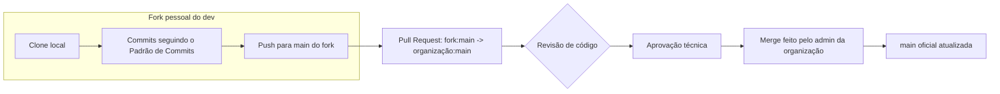

# Estratégia de Branch

## Contexto e motivação

Este é um projeto de 1º semestre de ADS, e a experiência da equipe com Git como um todo ainda é baixa — é normal que a maioria esteja aprendendo a usar branches, resolver conflitos e abrir Pull Requests pela primeira vez ao longo do próprio projeto. Um modelo com múltiplas branches de feature e permissões de push distribuídas entre todo o time aumentaria bastante o risco de conflitos mal resolvidos e de alterações acidentais quebrando a `main` compartilhada.

Por isso, o modelo adotado concentra o merge em uma única pessoa e faz cada membro trabalhar isolado no próprio fork até a mudança estar pronta e revisada. Isso funciona como uma rede de segurança: ninguém corre o risco de derrubar o projeto dos outros enquanto ainda está aprendendo o fluxo, e toda mudança passa por revisão antes de tocar na `main` oficial.

## Como configurar a organização no GitHub

- Apenas **uma pessoa** deve ter permissão de administrador/push direto na organização (o merge da `main` oficial passa só por ela).
- Nenhum outro membro deve ter permissão de escrita direta no repositório da organização.
- Não crie branches de feature (`feature/`, `fix/` etc.) dentro do repositório oficial — cada mudança deve nascer em um **fork pessoal**.

## Fluxo de trabalho (o que cada dev deve fazer)

1. **Fork:** faça um fork pessoal do repositório oficial da organização na sua própria conta do GitHub (uma vez só, no início).
2. **Clone local:** clone o seu próprio fork (não o repositório da organização) para a sua máquina.
3. **Alterações e commits:** faça as alterações localmente e commite seguindo o [Padrão de Commits](./Padrões%20de%20commits.md).
4. **Push:** suba as alterações para a `main` do seu próprio fork.
5. **Pull Request:** abra um PR do seu fork (`<seu-usuario>/api-1-semestre-2026:main`) para a `main` do repositório oficial da organização.
6. **Revisão de código:** aguarde a revisão dos responsáveis definidos abaixo antes de esperar o merge.
7. **Aprovação e merge:** somente a pessoa definida como administradora da organização aprova e realiza o merge na `main` oficial.

## Papéis e responsabilidades

| Papel | Responsável | O que faz |
| :--- | :--- | :--- |
| **Merge / aprovação final do PR** | Felipe Morais (Scrum Master) | Único membro com permissão de push/merge na `main` oficial da organização |
| **Revisão de código** | Henrique de Castro (Product Owner) e Marcus Vinicius (Dev Team) | Revisam o PR antes de ele ser aprovado — qualidade técnica e aderência à regra de negócio |
| **Autoria das alterações** | Todos os membros da Dev Team | Trabalham em seus próprios forks pessoais e abrem os PRs |

## Boas práticas para manter esse modelo funcionando

- Mantenha seu fork atualizado com a `main` oficial antes de começar uma alteração nova, para reduzir conflitos no PR.
- Escreva títulos de PR e mensagens de commit descritivos, seguindo o Padrão de Commits — como não existem branches nomeadas (`feature/producao-por-setor`, por exemplo) no repositório oficial, o **histórico de Pull Requests** é o principal registro de "o que foi feito e quando".
- Peça revisão sempre que tiver dúvida, mesmo em mudanças pequenas — é melhor perguntar antes do merge do que corrigir depois na `main` compartilhada.
